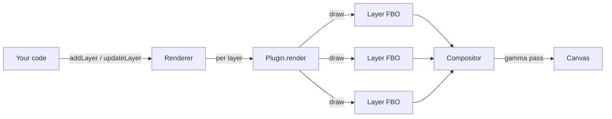
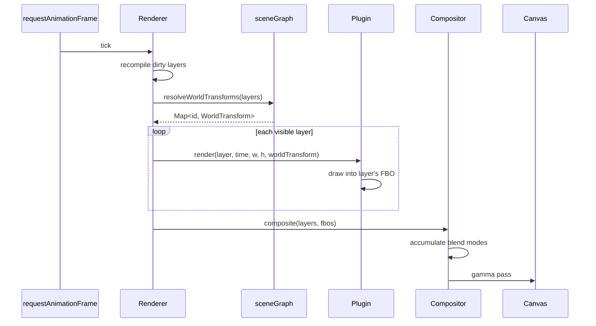

# Architecture

rae-noise is a WebGL2 library for rendering real-time procedural visuals — animated noise fields, layered gradients, palette-mapped color, and (in the future) particles, lines, and sprites. This guide is the starting point for understanding how the pieces fit together. After reading it you should be able to navigate the source, reason about what happens in a frame, and know which guide to read next for the area you care about.

## The one-sentence summary

A **renderer** holds a stack of **layers**. Each layer is rendered by its owning **plugin** into a **framebuffer object (FBO)**, and a **compositor** blends all the FBOs onto the canvas.

## Mental model



The renderer is an **orchestrator**. It does not know how to draw noise, or particles, or anything else — that responsibility lives in plugins. The renderer knows how to:

- Hold a list of layers and tell plugins to render them
- Walk the scene graph to compute world-space transforms
- Hand each layer's FBO to the compositor
- Import and export configs
- Register new plugins at runtime

Everything else delegates.

## The four big ideas

### 1. Plugins own visual types

Each *kind* of visual is a plugin: a self-contained module that implements the [`Plugin<L>`](API-Plugin) interface. The built-in `NoisePlugin` owns the noise layer type. A future `ParticlePlugin` would own a `ParticleLayerConfig` type. Plugins own their own shaders, GPU state, serialization format, and compiled output.

**Why it matters:** adding a new visual type is one new file. Zero changes to the renderer, compositor, serializer, or scene graph. The [Plugin system](Guide-Plugin-System) guide walks through this end to end.

### 2. Layers have shared chrome and plugin-specific data

Every layer has a `LayerBase`:

| Field | What it is |
|---|---|
| `id` | Stable identifier |
| `name` | Display label for editors |
| `plugin` | Discriminant — picks which plugin renders it |
| `opacity` | Blend factor in compositing |
| `blendMode` | `add` / `multiply` / `screen` / `overlay` |
| `visible` | Skip rendering when false |
| `parent` | Optional scene graph parent id |
| `transform` | Local `Transform2D` (position, rotation, scale) |

On top of that, each plugin layers its own fields. `NoiseLayerConfig` adds `noiseType`, `scale`, `octaves`, `palette`, `speed`, and so on. The `Layer` type is a discriminated union over the `plugin` field — TypeScript narrows it automatically in plugin code.

### 3. Rendering is a per-layer FBO + a composite pass

Each visible layer has its own framebuffer object. On every frame:

1. Each plugin draws its layer into that layer's FBO (isolation — layers don't touch each other's pixels)
2. The compositor accumulates the FBOs onto a single render target using the right blend modes
3. A final gamma correction pass copies the accumulator to the canvas

The [Rendering pipeline](Guide-Rendering-Pipeline) guide goes into full detail, including ping-pong accumulation for overlay blend.

### 4. There are two kinds of schema version

rae-noise's JSON config format has two independent version numbers:

- **Envelope version** (`RendererConfig.version`) — the shape of the top-level config. Very stable.
- **Plugin schema version** (`LayerEntry.bv`) — the shape of one plugin's layer fields. Each plugin bumps its own.

This means a plugin can go through six schema versions without touching envelope code. The serializer doesn't know what a noise layer looks like — it asks `plugin.serialize(layer)` and stores the result in a versioned envelope slot. See the [Plugin system](Guide-Plugin-System) guide for how to write a migration.

## The source tree

```
packages/core/src/
├── index.ts          # public API re-exports
├── types/            # Plugin, Layer, Transform2D, RendererConfig, CompiledScene
├── webgl/            # program, quad, FBO — thin WebGL2 wrappers
├── plugin/
│   └── noise/        # built-in noise plugin: shaders, builder, GLSL chunks
├── compositor/       # FBO ping-pong blending + gamma pass
├── compiler/         # design-time → production-time scene compiler
├── config/           # JSON envelope serializer
└── renderer/         # Renderer orchestrator, defaults, scene graph resolver
```

Each directory has a `@file` header at the top of its index or main file explaining what it's for — start there when opening a new area.

## A frame, start to finish



The [`Renderer`](API-Renderer) class owns the outer RAF loop. [`resolveWorldTransforms`](../packages/core/src/renderer/sceneGraph.ts) walks the scene graph (see the [Scene graph](Guide-Scene-Graph) guide). Plugins draw into their FBOs; the [`Compositor`](../packages/core/src/compositor/compositor.ts) blends them.

## Where to go next

- **"I want to write a plugin"** → [Plugin system](Guide-Plugin-System)
- **"I want to understand the GPU side"** → [Rendering pipeline](Guide-Rendering-Pipeline)
- **"I want to group and move layers"** → [Scene graph](Guide-Scene-Graph)
- **"I want the API reference"** → browse `API-*` pages in the sidebar

## Further reading

- [WebGL2 Fundamentals](https://webgl2fundamentals.org/) — the canonical reference for the GPU primitives rae-noise uses
- [The Book of Shaders](https://thebookofshaders.com/) — great background on the procedural noise techniques the built-in plugin implements
- [Inigo Quilez's articles](https://iquilezles.org/articles/) — deep, rigorous writing on noise, SDFs, and procedural visuals
