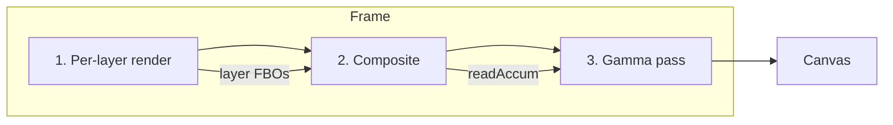
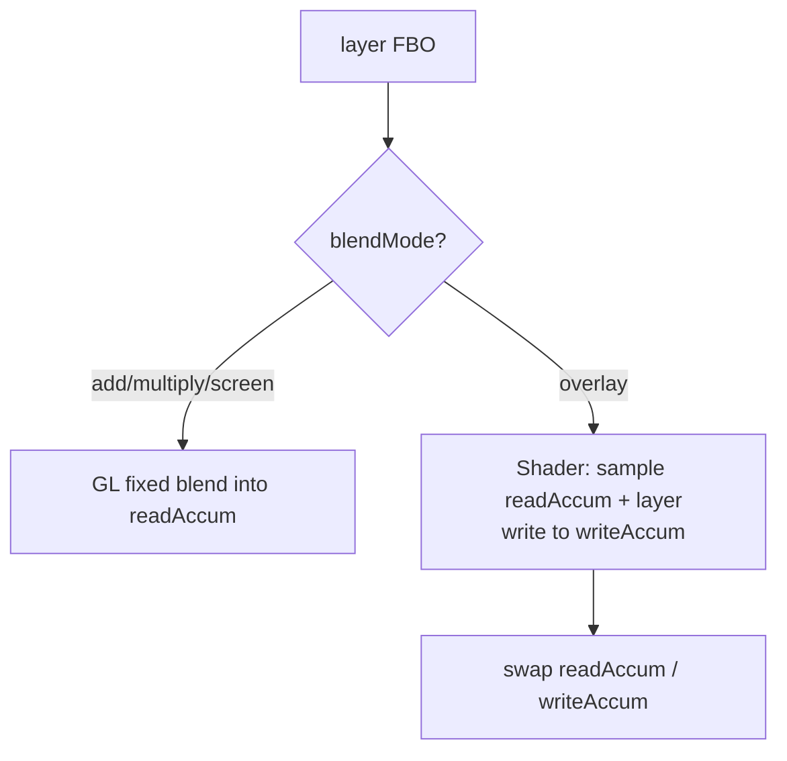

# Rendering pipeline

This guide walks through exactly what happens on the GPU between "I added a layer" and "pixels on the canvas." If you're adding a plugin, modifying the compositor, or debugging a blend-mode issue, read this first. For the higher-level picture, start with the [Architecture](Guide-Architecture) guide.

## The big picture

rae-noise renders each layer into its own framebuffer object (FBO), then composites those FBOs onto an accumulation target, then does one final gamma pass to the canvas. Three stages, strictly ordered:

The separation matters. Per-layer rendering doesn't need to know about blend modes. Compositing doesn't need to know about shaders. Gamma correction doesn't need to know about layers at all.

## Stage 1 — per-layer render

For every visible layer, in order, the renderer:

1. Calls `compositor.ensureFBO(layer.id, width, height)` to get (or create) a framebuffer sized to the canvas.
2. Calls `plugin.render(layer, time, width, height, worldTransform)` on the plugin that owns this layer's type.

The plugin draws whatever it wants into the bound FBO. For noise, that's a fullscreen quad with a shader built from GLSL chunks. For a future particle plugin, that'd be instanced quads drawn with a particle shader. The point is the compositor doesn't care — it just ends up with a texture per layer.

### Why per-layer FBOs and not direct-to-canvas?

Three reasons:

1. **Isolation.** Each plugin gets a clean canvas for itself. It can use its own blend state, depth state, whatever, without leaking into other layers.
2. **Correct blending.** GL's fixed-function blending reads the current framebuffer and blends new fragments into it. If layer 2 draws directly on top of layer 1, layer 2's internal blending interferes with the layer-1-to-layer-2 blend. An FBO per layer gives the compositor clean "source" textures to blend.
3. **Reuse.** The compiler (design-time → production-time) and possible postprocess passes all want to read layer textures after they're fully rendered.

### Dirty layers and shader recompilation

Before the per-layer render loop, the renderer processes any *dirty* layers. A layer is dirty when a **structural** field has changed — one that affects the shader source, not just uniforms.

For the noise plugin, structural fields are `noiseType`, `flowType`, `octaves`, `animate`, `warp`, and `curlStrength`. Changing any of those triggers `plugin.needsRecompile(prev, next) === true`, which makes the renderer call `plugin.recompile(id, layer)` before the next frame. Everything else (`speed`, `scale`, `palette`, `contrast`, `brightness`, `direction`, `opacity`, `blendMode`) is uniform-only: the existing shader stays, and the new values are uploaded next time `render` runs.

This is the key optimization that makes the editor UI feel instant. Dragging the `speed` slider pushes a uniform per frame. Changing `noiseType` rebuilds a shader once.

## Stage 2 — composite

Now every visible layer has an up-to-date FBO. The compositor's job is to combine them into a single output texture.

It holds two accumulation FBOs (`accumA`, `accumB`) and **ping-pongs** between them. One is the *read* accumulator (what's been drawn so far), the other is the *write* accumulator (the destination for the next pass). Ping-ponging is needed because the `overlay` blend mode has to sample both the source and the destination, which GL's fixed-function blending can't express.

### The two paths

**Simple blends (`add`, `multiply`, `screen`):** The compositor binds the read accumulator as the draw target, enables GL blending with the right `blendFunc`, and draws a fullscreen quad sampling the layer texture. The GPU's ROP blends it in. Cheap.

| Mode | `blendFunc` | Effect |
|---|---|---|
| `add` | `(SRC_ALPHA, ONE)` | additive — layers brighten |
| `multiply` | `(DST_COLOR, ZERO)` | multiplicative — layers darken |
| `screen` | `(ONE, ONE_MINUS_SRC_COLOR)` | inverse-multiply — bright haze |

**Overlay:** A custom fragment shader samples both the read accumulator (`u_dest`) and the layer FBO (`u_layer`), computes the overlay math (light pixels brighten, dark pixels darken), and writes the result to the *write* accumulator. The roles of the two accumulators are then swapped so the next layer's read source is the freshly-written one.

### Why `opacity` is always uniform-blended, not in GL state

All four blend paths respect the layer's `opacity`. For the simple path it's baked into the fragment shader (`fragColor.a *= u_opacity`), not set via `glBlendColor`. For overlay it's used as the `mix()` factor between destination and blended. This keeps the opacity handling consistent regardless of blend mode.

## Stage 3 — gamma pass

After all layers are composited, the read accumulator holds the final scene in linear space (or at least, in whatever color space the plugins wrote). The compositor binds the canvas framebuffer (`FRAMEBUFFER = null`) and draws one last fullscreen quad: `pow(color, 0.8)`.

It's a deliberately subtle curve — not a true sRGB conversion, just a perceptual darken-the-midtones pass that makes the noise output look less washed out. If you need strict color management you'd replace this with a real sRGB pass or a tonemapper.

## Resource management

Three kinds of GPU resources move around the pipeline:

| Resource | Owner | Lifetime |
|---|---|---|
| Per-layer FBO | Compositor (`layerFBOs` map) | Created on first render, resized each frame, destroyed on `removeLayer` |
| Accumulation FBOs (A and B) | Compositor (`accumA`/`accumB`) | Created on first composite, resized every frame |
| Layer shader program | Plugin (internal) | Created on first render, rebuilt on structural change, destroyed on `destroy` |
| Compositor programs | Compositor (simple / overlay / gamma) | Created once in constructor, destroyed with compositor |

FBOs resize in place — they don't get rebuilt when the canvas changes size. The resize path reallocates the backing texture but keeps the `WebGLFramebuffer` object alive.

## Debugging checklist

If the canvas is wrong, walk the pipeline in order:

1. **Black canvas** → is any layer visible? Is `plugin.render` being called? Try logging from the plugin.
2. **One layer renders wrong but others look fine** → it's a plugin bug. Bind the layer's FBO directly to the canvas for a frame and see what's in it.
3. **Layers render fine individually but composite wrong** → blend mode or opacity. Inspect the `accumA`/`accumB` textures. You can add a temporary `gl.drawBuffers` readback or just swap the final gamma pass to display one of the accum textures.
4. **Everything looks washed out or dark** → suspect the gamma pass. Temporarily set `pow(..., 1.0)` and see.
5. **Colors look banded** → FBO format. The default is `RGBA8`; a plugin generating HDR output will clip. Upgrade to `RGBA16F` in [`webgl/fbo.ts`](../packages/core/src/webgl/fbo.ts).

## Further reading

- [WebGL2 Fundamentals — Framebuffers](https://webgl2fundamentals.org/webgl/lessons/webgl-framebuffers.html)
- [Khronos wiki — Blend equation](https://www.khronos.org/opengl/wiki/Blending)
- [Bart Wronski — Small color correction tricks](https://bartwronski.com/) — good intuition for gamma and tonemapping
- The source: [`compositor/compositor.ts`](../packages/core/src/compositor/compositor.ts), [`webgl/fbo.ts`](../packages/core/src/webgl/fbo.ts), [`plugin/noise/index.ts`](../packages/core/src/plugin/noise/index.ts)
