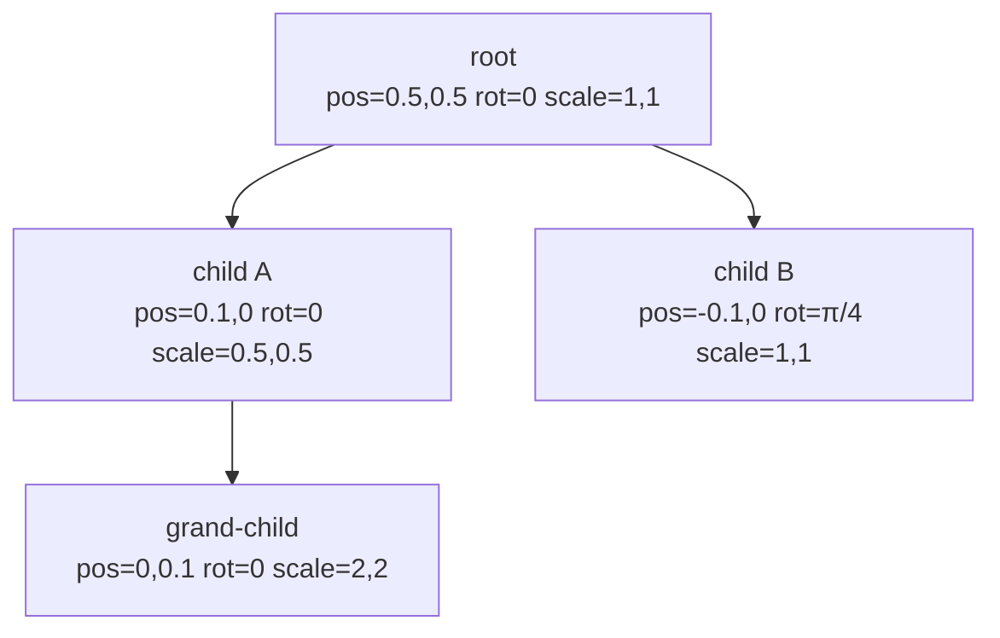

# Scene graph

rae-noise has a lightweight Unity-style scene graph: every layer can have a parent, and transforms compose down the chain. This guide covers what the scene graph guarantees, what it doesn't, and how plugins should interpret world transforms in their render code.

For the broader context on where the scene graph sits in the pipeline, see the [Architecture](Guide-Architecture) guide.

## What a transform looks like

Every layer has an optional `transform: Transform2D`:

```ts
interface Transform2D {
  position: [number, number]; // normalized canvas coords, 0..1
  rotation: number;           // radians
  scale: [number, number];    // component-wise
  anchor?: [number, number];  // rotation/scale pivot, default [0.5, 0.5]
}
```

Positions are in **normalized canvas space** — `[0, 0]` is the top-left corner, `[1, 1]` is the bottom-right. Rendering code multiplies by pixel width/height if it needs screen coordinates. This keeps transforms resolution-independent — resize the canvas and layers stay where you put them.

## Parent-child composition

Any layer can have `parent: string` — the id of another layer. Every frame, [`resolveWorldTransforms`](API-resolveWorldTransforms) walks the list and returns a map from layer id to the resolved `WorldTransform`:



The walker memoizes results per frame, so a deep chain isn't re-walked for every descendant.

## The composition rules

This is the part to understand carefully. rae-noise does **not** use a full 2D affine matrix. It composes the three fields independently:

```
world.position = parent.world.position + local.position × parent.world.scale
world.rotation = parent.world.rotation + local.rotation
world.scale    = parent.world.scale × local.scale    (component-wise)
```

### What this gives you

- **Translation is hierarchical.** Move a parent, all descendants move with it.
- **Scale is hierarchical.** Scale a parent to 0.5, child offsets are halved.
- **Rotation is hierarchical in the sense that rotations add up.** A child at rotation `π/4` whose parent is at rotation `π/4` is at world rotation `π/2`.

### What it does *not* give you

**Rotating a parent does not orbit its children around the parent's position.** Children rotate in place at their own position. This is the single most important thing to internalize — it's the one place the scene graph diverges from what Unity or a real affine compose would do.

If you need orbit behavior (a child that revolves around its parent when the parent rotates), you either:

1. Do the rotation math yourself in your plugin's render code (multiply the child's local position by the parent's rotation matrix before applying the parent offset), or
2. Upgrade `resolveWorldTransforms` to a proper affine matrix compose. Nothing else in the codebase depends on the current rules being non-affine, so the upgrade path is clean. This was a deliberate first cut because no built-in plugin needs orbit yet.

## How plugins should use the transform

`plugin.render` receives a `WorldTransform` as its last argument. What you do with it depends on what kind of plugin you are.

### Full-canvas plugins

The noise plugin is full-canvas: it draws a fullscreen quad into its FBO regardless of layer position. It **ignores** the `worldTransform` argument entirely. Transforms on a noise layer are meaningful for the editor UI (grouping, parent offset) but don't change the rendered output — the noise fills the whole FBO.

This is fine. Not every plugin has to be placement-aware.

### Placement-aware plugins

A future sprite, particle, or line plugin should use the world transform as its model transform:

```ts
render(layer, time, width, height, worldTransform) {
  // worldTransform.position is normalized — multiply by canvas size.
  const cx = worldTransform.position[0] * width;
  const cy = worldTransform.position[1] * height;

  // Bake rotation and scale into your vertex shader's model matrix,
  // or multiply into your instance buffer before uploading.
  const modelMatrix = compose2D(
    [cx, cy],
    worldTransform.rotation,
    [worldTransform.scale[0] * width, worldTransform.scale[1] * height]
  );

  // ...draw with modelMatrix as a uniform
}
```

The anchor (`[0.5, 0.5]` by default) is the pivot for rotation and scale. A sprite at `anchor = [0, 0]` rotates around its top-left corner; at `anchor = [0.5, 0.5]` it rotates around its center.

## Cycle prevention

You can't create a cycle in the graph. `renderer.setParent(childId, parentId)` walks up the proposed parent's chain and throws if it would close a loop. That means [`resolveWorldTransforms`](API-resolveWorldTransforms) can trust the graph is a forest and doesn't need cycle detection of its own — it would recurse forever if it ran on a cyclic graph.

Two other correctness properties:

- **Orphaned parents are tolerated.** If a layer references a `parent` id that no longer exists in the layer list, the walker treats it as if it had no parent. This keeps the renderer alive across layer removal races.
- **Every layer ends up with an entry.** Even a layer with no transform resolves to identity. Plugin code can always call `transforms.get(layerId)!` without null-checking.

## Plugin API touch points

| Method | Purpose |
|---|---|
| [`renderer.addLayer`](API-RaeNoiseRenderer) | Creates a layer. Transform defaults to identity. |
| [`renderer.updateLayer`](API-RaeNoiseRenderer) | Patches a layer; can include a `transform` field. |
| [`renderer.setParent`](API-RaeNoiseRenderer) | Sets or clears a layer's parent. Throws on cycles. |
| [`renderer.reorderLayers`](API-RaeNoiseRenderer) | Reorders the layer list. **Independent of the graph** — ordering controls compositing (bottom to top), parenting controls transforms. |

That last point trips people up. Reordering a layer does not change its parent. Reparenting a layer does not change its draw order. The two are deliberately separate because a child layer can legitimately be drawn *below* its parent (a shadow behind a moving object, for example).

## Further reading

- [Unity's Transform system docs](https://docs.unity3d.com/Manual/class-Transform.html) — the conceptual model rae-noise's transform is modeled after (scaled down to 2D and simplified)
- [WebGL2 Fundamentals — 2D Matrices](https://webgl2fundamentals.org/webgl/lessons/webgl-2d-matrices.html) — if you want to upgrade to a real affine compose
- Source: [`renderer/sceneGraph.ts`](../packages/core/src/renderer/sceneGraph.ts)
